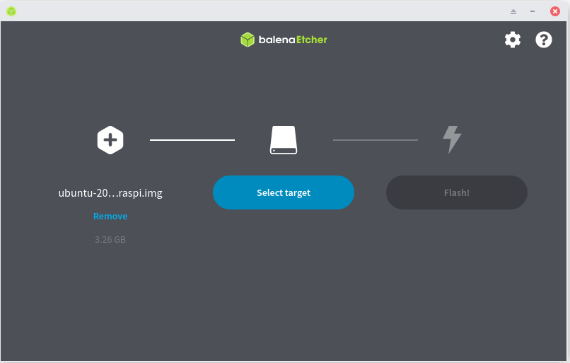
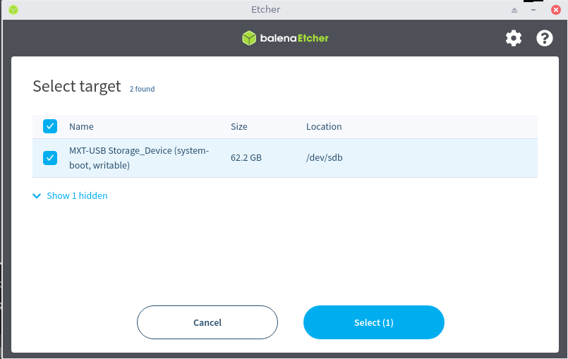
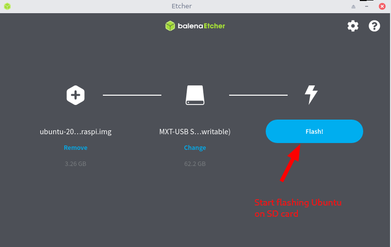
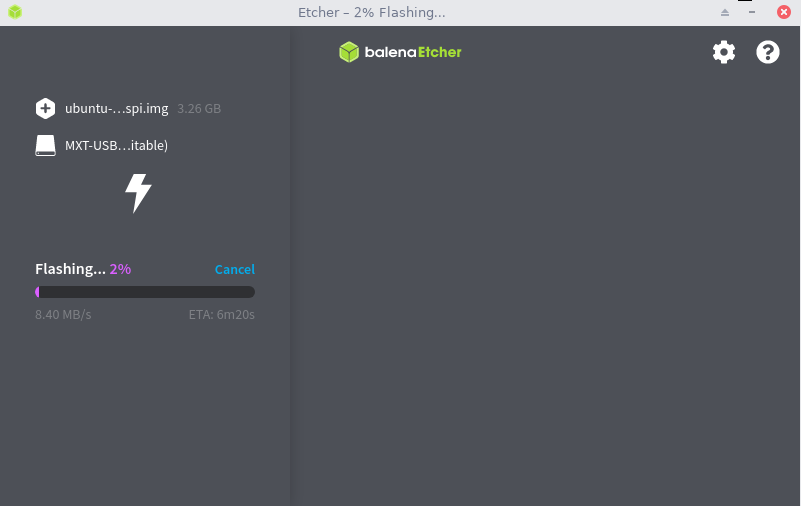
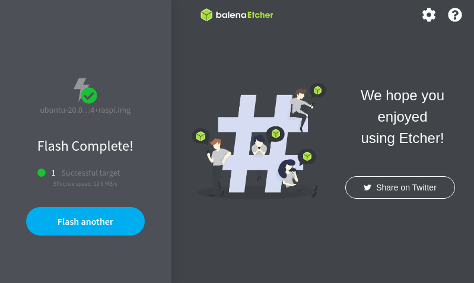
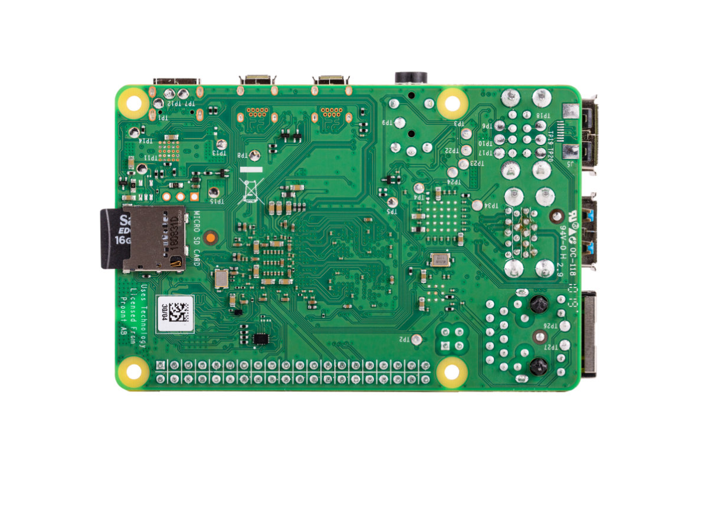
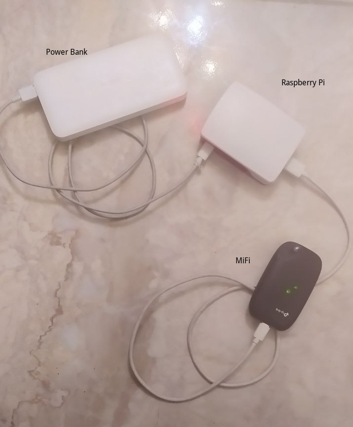

# XCapGroup Rpi Captive Portal

Raspberry Pi Captive portal project for XCap Group Inc.

## Hardware requirements

This document is explaining the project installation on

- Raspberry Pi with ARM64 bit processor (Raspberry Pi 3 or 4) , but Raspberry Pi 4 is recommended with 2GB RAM, so you don't run out of RAM later since Pi 3 was only 1GB RAM, as well as USB type C cable(or microUSB for Raspberry Pi 3) and power source.
- SD Card (8GB should be sufficient, It is tested with 64GB).
- MiFi with USB over Ethernet support, and its USB cable.

## Raspberry Pi system preparation

**On your PC/Laptop:**

1. Download [**Ubuntu Server 20.04 LTS (Codename: Focal) Arm64 for Raspberry Pi**](https://cdimage.ubuntu.com/releases/20.04.2/release/ubuntu-20.04.2-preinstalled-server-arm64+raspi.img.xz)

2. Download **[Balena Etcher](https://www.balena.io/etcher/)** to flash the Ubuntu image to a SD memory card.

3. Open Balena Etcher, click **Flash from file**, and choose the Ubuntu image downloaded in step 1.

   

4. Click **Select target**, and choose the SD card (or the USB SD card reader) that you want to flash the os onto, then click **Select**.

   **WARNING:** Everything on the selected SD card will be lost!

   

5. Click **Flash**
   You may be asked to Allow administration access and/or be prompted for Administrator password.

   

6. Wait for flashing to complete

   

   When it is completed, you should find the following dialog

   

7. From your file manager, mount the **writable** SD card partition, navigate to **etc/netplan/** under this partition , then open a terminal in this path, and execute the following

   ```bash
   sudo nano 50-cloud-init.yaml
   ```

   Delete all content then paste the following

   ```yaml
   network:
     version: 2
     ethernets:
       eth0:
         dhcp4: true
         optional: true
       usb0:
         dhcp4: true
         optional: true
   ```

   Then save by pressing **CTRL+X** then **Y**, then **Enter**

   You can now safely remove the SD card (or USB card reader)

8. Plug the SD card in Raspberry Pi SD Card slot

   

9. Plug your Raspberry Pi to power source, and MiFi (via USB), you should be connecting your PC/laptop to the MiFi as well (i.e: over WiFi), so you can SSH into the Pi.
   

10. Log in to the MiFi admin control panel, find the connected devices to get the Pi IP address, or uning a network scanner like [Fing](https://www.fing.com/products/fing-desktop) or nmap.

11. From your terminal, type

    ```bash
    ssh ubuntu@1.2.3.4
    ```

    but replace the placeholder _1.2.3.4_ with the actual Raspberry Pi IP address, the default password is **ubuntu**, you will be asked to change the password once logged in.

    #ubunutu/aleacbd

12. Download the project archive to the Raspberry pi, you can use something like file.io

    1. Upload the zip archive to [file.io](https://file.io) from your PC/Laptop browser, then copy the link

    2. In the Pi, download the file using wget `wget https://file.io/EXAMPLE_LINK -O project.zip` , replace the placeholder link with the actual link

    3. Install unzip command `sudo apt install unzip -y`

    4. Extract the archive `unzip project.zip`

13. Make sure you are connected to the network `ping -c 3 example.com`

14. If you want to use spanish version, run `export APP_LANG=es`, otherwise, the english version is the default.

15. Run the installation script `sudo bash xcapgroup-rpi-cp/scripts/install.sh`

<!-- $form_name_field=$name
$form_phone_field=$phone
$form_gender_field=$gender
$form_age_field=$age -->
